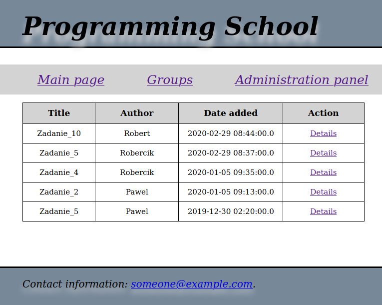
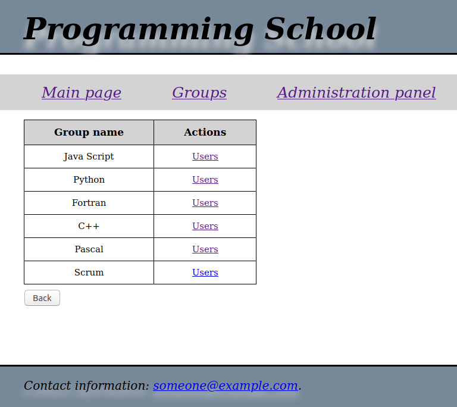

# Warsztaty_3

## Introduction
Warsztaty_3 is based on Warsztaty_2 [https://github.com/Pawel922/Warsztaty_2].
It uses JSP technology and MVC design pattern to provide easiest to use and more interactive application to manage programming school.

## Description
Hereunder you can find some screen shots which presents main functionality:
* main page which shows last 5 added exercises

* panel groups which allow to show which users belong to particular groups

* administration panel which allows to edit/delete/add exercises/groups and users
